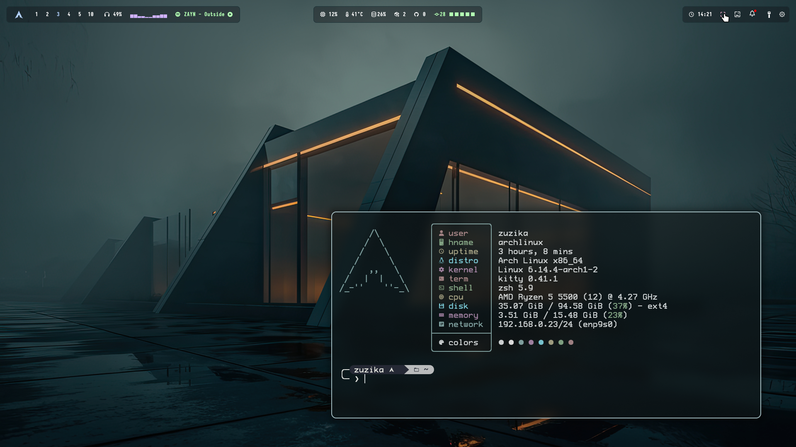
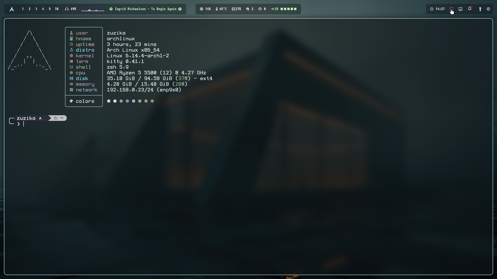

# Dotfiles

My personal dotfiles for customizing my Wayland setup (Hyprland) on Arch Linux.  

### Home

### Kitty

### Waybar

### Wlogout

## Dependencies

This setup relies on several key packages and tools.

A script containing all the essential packages can be found at: packages/arch